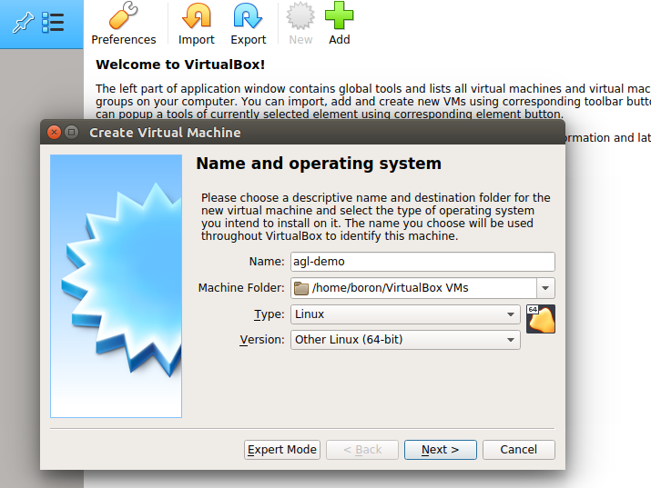
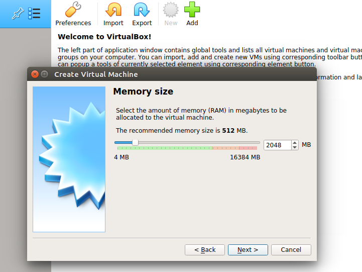
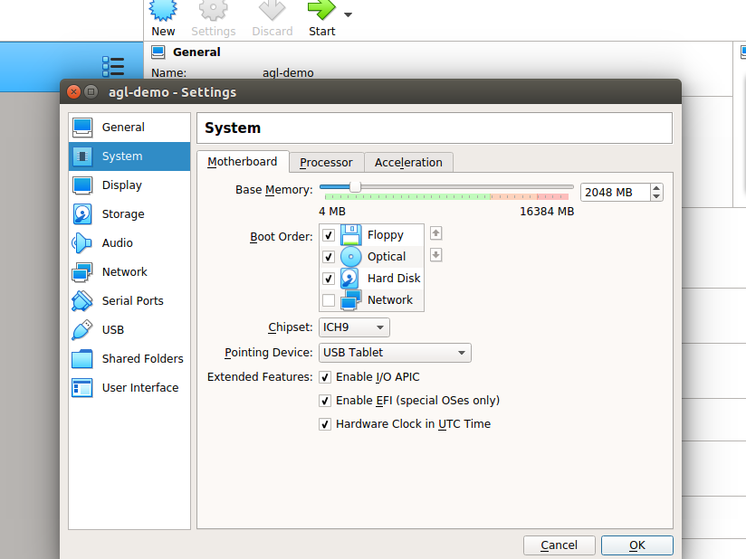
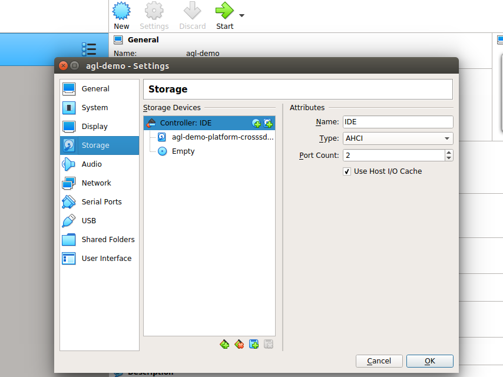

Building an image for emulation allows you to simulate your
image without actual target hardware.

This section describes the steps you need to take to build the
AGL demo image for emulation using either Quick EMUlator (QEMU) or
VirtualBox, and later the same image can be used to boot any hardware.

## 1. Making Sure Your Build Environment is Correct

The
"[Initializing Your Build Environment](./3_Initializing_Your_Build_Environment.md)"
section presented generic information for setting up your build environment
using the `aglsetup.sh` script.
If you are building the AGL demo image for emulation, you need to specify some
specific options when you run the script:

**Qt based IVI demo :**

```bash
$ source meta-agl/scripts/aglsetup.sh -f -m qemux86-64 -b qemux86-64 agl-demo agl-devel
$ echo '# reuse download directories' >> $AGL_TOP/site.conf
$ echo 'DL_DIR = "$HOME/downloads/"' >> $AGL_TOP/site.conf
$ echo 'SSTATE_DIR = "$AGL_TOP/sstate-cache/"' >> $AGL_TOP/site.conf
$ ln -sf $AGL_TOP/site.conf conf/
```

**HTML5 based IVI demo :**

```bash
$ source meta-agl/scripts/aglsetup.sh -f -m qemux86-64 -b qemux86-64 agl-demo agl-devel agl-profile-graphical-html5
$ echo '# reuse download directories' >> $AGL_TOP/site.conf
$ echo 'DL_DIR = "$HOME/downloads/"' >> $AGL_TOP/site.conf
$ echo 'SSTATE_DIR = "$AGL_TOP/sstate-cache/"' >> $AGL_TOP/site.conf
$ ln -sf $AGL_TOP/site.conf conf/
```

The "-m" option specifies the "qemux86-64" machine.
The list of AGL features used with script are appropriate for development of
the AGL demo image suited for either QEMU or VirtualBox.

## 2. Using BitBake

Start the build using the `bitbake` command.

**NOTE:** An initial build can take many hours depending on your
CPU and and Internet connection speeds.
The build also takes approximately 100G-bytes of free disk space.

**Qt based IVI demo :**
The target is `agl-demo-platform`.

```bash
  $ time bitbake agl-demo-platform
```

By default, the build process puts the resulting image in the Build Directory and further exporting that as `$IMAGE_NAME`:

```
<build_directory>/tmp/deploy/images/qemux86-64/agl-demo-platform-qemux86-64.vmdk.xz

$ export IMAGE_NAME=agl-demo-platform-qemux86-64.vmdk.xz
```

**HTML5 based IVI demo :**
The target is `agl-demo-platform-html5`.

```bash
  $ time bitbake agl-demo-platform-html5
```
By default, the build process puts the resulting image in the Build Directory and further exporting that as `$IMAGE_NAME`:

```
<build_directory>/tmp/deploy/images/qemux86-64/agl-demo-platform-html5-qemux86-64.vmdk.xz

$ export IMAGE_NAME=agl-demo-platform-html5-qemux86-64.vmdk.xz
```


## 3. Deploying the AGL Demo Image

Deploying the image consists of decompressing the image and then
booting it using either QEMU, VirtualBox or physical system.

**3.1 QEMU**

Depending on your Linux distribution, use these commands to install QEMU:

If you built your image with bitbake, you can now just use the ``runqemu`` wrapper, after sourcing `agl-init-build-env` inside the build-dir :

```
For this example :
$ source $AGL_TOP/master/qemux86-64/agl-init-build-env 

In general :
$ source $AGL_TOP/<release-branch-name>/<build-dir>/
```
And further use `runqemu` to boot the image :
```bash
$ runqemu tmp/deploy/images/qemux86-64/agl-demo-platform-qemux86-64.qemuboot.conf kvm serialstdio slirp publicvnc audio
```

If you need to run it outside of the bitbake environment or need special settings for
hardware pass-through using `qemu` :


**NOTE:** if you have created an AGL crosssdk, it will contain a
QEMU binary for the build host.
This SDK QEMU binary does not support graphics.
Consequently,  you cannot use it to boot the AGL image and
need to call your host's qemu binary instead.

**NOTE:** the VM images need UEFI in the emulator to boot. Thus you need
to install the necessary files with below commands (ovmf).

If your build host is running
[Arch Linux](https://www.archlinux.org/), use the following commands:

```bash
sudo pacman -S qemu ovmf
export OVMF_PATH=/usr/share/ovmf/x64/OVMF_CODE.fd
```

If your build host is running Debian or Ubuntu, use the following commands:

```bash
sudo apt-get install qemu-system-x86 ovmf
export OVMF_PATH=/usr/share/ovmf/OVMF.fd
```

If you build host is running Fedora, use the following commands:

```bash
sudo yum install qemu qemu-kvm edk2-ovmf
export OVMF_PATH=/usr/share/edk2/ovmf/OVMF_CODE.fd
```
**Note:**

Once QEMU is installed, boot the image with KVM support:


```bash
qemu-system-x86_64 -enable-kvm -m 2048 \
    -bios ${OVMF_PATH} \
    -hda ${IMAGE_NAME} \
    -cpu kvm64 -cpu qemu64,+ssse3,+sse4.1,+sse4.2,+popcnt \
    -vga virtio -show-cursor \
    -device virtio-rng-pci \
    -serial mon:stdio -serial null \
    -soundhw hda \
    -net nic \
    -net user,hostfwd=tcp::2222-:22
```

**NOTE:** KVM may not be supported within a virtualized environment such as
VirtualBox. This is indicated by the qemu command above giving the error
message `Could not access KVM kernel module: No such file or directory` or
the kernel log output contains the error message `kvm: no hardware support`.
The image can be booted in such an environment by removing `-enable-kvm` from
the qemu command line, however this will result in lower perfromance within
the AGL demo.

**3.2 VirtualBox**

Once VirtualBox is installed, follow these steps to boot the image:

  1. Install and set up [Virtual Box](https://www.virtualbox.org/wiki/Linux_Downloads).

  2. Extract the vmdk file : 
  ```bash
    cd tmp/deploy/images/qemux86-64
    xz -d ${IMAGE_NAME}
    ```

  3. Configure virtual box for AGL :
    - Click on `New` or `Add`.
    - Enter Name as `agl-demo`.
    - Type as `Linux`.
    - Version as `Other Linux (64-bit)`, click on `Next`.
    
    - Select Memory size. Recommended is `2048 MB`, click on `Next`.
    
    - Click on `Use an existing virtual hard disk file`, and select the extracted `agl-demo-platform-qemux86-64.vmdk.xz` or `<html5-image?>` file, click on `Create`.
    
    - Go to `Settings`, and into `System`. Select `Chipset : IHC9`. Check on `Enable EFI (special OSes only)` and click on `OK`.
    
    - Go to `Storage`, and change the attribute to `Type : AHCI` and click on `OK`.
    
    - Click on `Start`.
    - For troubleshooting, you can refer [here](https://lists.automotivelinux.org/g/agl-dev-community/message/8474).

**3.3 x86 physical system**
  
  **NOTE :** UEFI enabled system is required.
  
  1. Extract the image into USB drive :
    
    ```bash
        $ cd tmp/deploy/images/qemux86-64
        $ lsblk
        $ sudo umount <usb_device_name>
        $ xzcat agl-demo-platform-qemux86-64.wic.xz | sudo dd of=<usb_device_name> bs=4M
        $ sync
    ```

  2. Boot from USB drive on the x86 system.